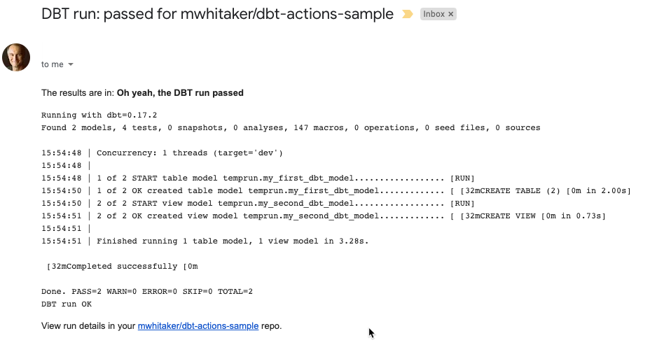

## Sample dbt project using dbt-action

Here is a workflow that I use with [dbt-action](https://github.com/mwhitaker/dbt-action) to schedule and run [dbt](https://www.getdbt.com) commands. It kicks off a new dbt run when I update the model. It also runs automatically on a daily schedule. When the run is complete, I hand off the dbt console output to the awesome [SendGrid Action](https://github.com/marketplace/actions/sendgrid-action). 

```yml
name: Schedule dbt

on:
  push:
  schedule:
   - cron:  '0 8 * * *'

jobs:
  action:
    runs-on: ubuntu-latest

    steps:
      - uses: actions/checkout@v2

      - name: dbt-run
        uses: mwhitaker/dbt-action@master
        with:
          dbt_command: "dbt run --profiles-dir ."
          dbt_project_folder: "dbt_project"
        env:
          DBT_BIGQUERY_TOKEN: ${{ secrets.DBT_BIGQUERY_TOKEN }}

      - name: SendGrid
        uses: peter-evans/sendgrid-action@v1
        env:
          SENDGRID_API_KEY: ${{ secrets.SENDGRID_API_KEY }}
          SENDGRID_FROM: ${{ secrets.SENDGRID_FROM }}
          SENDGRID_TO: ${{ secrets.SENDGRID_TO }}
```

The SendGrid Action uses a node.js file for configuration. Here is one example that lets you know whether the run has failed or passed and sends the dbt console output in the body of the email.

```js
#! /usr/bin/env node

const fs = require('fs')
const sgMail = require('@sendgrid/mail')
sgMail.setApiKey(process.env.SENDGRID_API_KEY)

const filepath = process.env.DBT_LOG_PATH
const data = fs.readFileSync(filepath)
const msg = {
    to: process.env.SENDGRID_TO,
    from: process.env.SENDGRID_FROM,
    subject: `DBT run: ${process.env.DBT_RUN_STATE} for ${process.env.GITHUB_REPOSITORY}`,
    text: 'Hello plain world!',
    html: `
       <p>The results are in: <b>${process.env.DBT_RUN_STATE === "passed" ? "Oh yeah, the DBT run passed" : "Oh no. It's a fail. What happened?"}</b></p>
       <pre>${data.toString()}</pre>
       <p>View run details in your <a href="https://github.com/${process.env.GITHUB_REPOSITORY}/actions/runs/${process.env.GITHUB_RUN_ID}">${process.env.GITHUB_REPOSITORY}</a> repo.</p>
       `,
};

sgMail
.send(msg)
.then(() => console.log('Mail sent successfully'))
.catch(error => console.error(error.toString()));
```
The email I get looks something like this:


